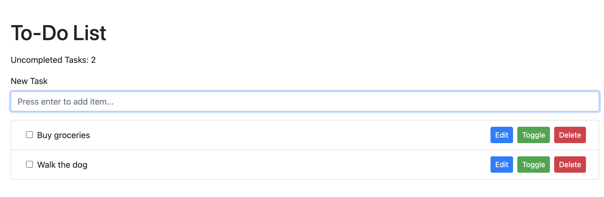

# vuedo

## Description
A todo list written using Vue.JS v3 with a flavor of Bootstrap



## Project setup
```
npm install
```

### Compiles and hot-reloads for development
```
npm run serve
```

### Compiles and minifies for production
```
npm run build
```

### Lints and fixes files
```
npm run lint
```
